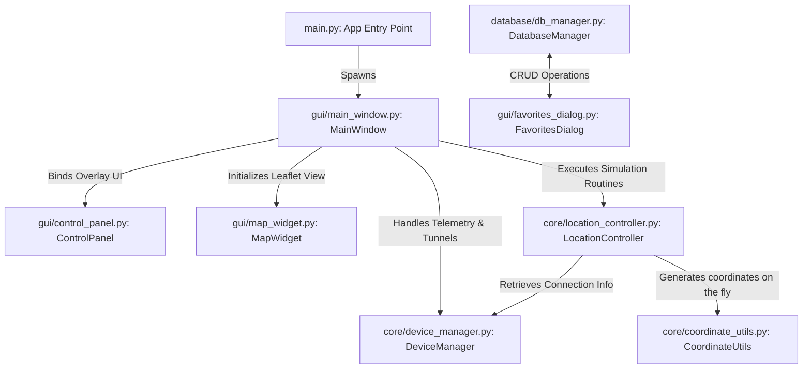

# Marcel Location Simulator 📱⚡

> Premium, High-Performance iPhone GPS Location Spoofing and Route Simulation Suite for Windows, macOS, and Linux. Built and designed by **Marcel Afsar**.

---

## 📖 Part 1: Quick Launch & Usage Guide

This section describes how to set up your environment, launch the application from source, and utilize the features of **Marcel Location Simulator** on Windows, macOS, and Linux.

### 1. Prerequisites & System Setup
To successfully interface with and simulate location parameters on an Apple iPhone, verify the following configuration requirements based on your host operating system:

#### A. All Platforms (Common Requirements)
- **USB Cable:** Use a high-quality MFi-certified USB-A/C to Lightning/USB-C connection cable.
- **iOS Developer Mode (Mandatory):**
  1. On your target iPhone, open **Settings**.
  2. Navigate to **Privacy & Security** > scroll to the absolute bottom and tap **Developer Mode**.
  3. Toggle the **Developer Mode** switch to **ON**.
  4. Allow the iPhone to restart.
  5. After rebooting, unlock the screen and tap **Turn On** on the confirmation dialog, then enter your passcode.
- **Computer Trust:** Plug your iPhone into the computer, unlock the device screen, tap **Trust This Computer**, and enter your lock screen passcode.

#### B. Platform-Specific Setup

##### 🪟 Windows
- **Operating System:** Windows 10 or 11 (64-bit).
- **iTunes / Usbmuxd Drivers:** Install iTunes for Windows to ensure the system is equipped with the core Apple USB driver suite (`usbmuxd`).

##### 🍏 macOS
- **Operating System:** macOS 11 (Big Sur) or newer.
- **Usbmuxd Drivers:** Built-in natively. No extra driver setup is needed. Xcode Command Line Tools are recommended (`xcode-select --install`).

##### 🐧 Linux
- **Operating System:** Any modern Linux distribution (e.g., Ubuntu 20.04+).
- **Usbmuxd Daemon:** Install `usbmuxd` and `libimobiledevice` packages using your package manager.
  - *Debian/Ubuntu:* `sudo apt update && sudo apt install usbmuxd libimobiledevice-utils`
  - Ensure the `usbmuxd` service is enabled and running: `sudo systemctl enable --now usbmuxd`

---

### 2. Launching from Source
Since the application spawns background connection daemons to interface with the iOS device tunnel, **you must run the terminal with Administrator/root privileges**.

#### A. Installation
Install the required Python modules directly on your system (virtual environments are omitted for direct global/user launch):
```bash
pip install -r requirements.txt
```

#### B. Launch Instructions by OS

##### 🪟 Windows
1. Press the **Windows Key**, type **PowerShell** or **Command Prompt**, right-click, and select **Run as Administrator**.
2. Navigate to the project directory:
   ```cmd
   cd "C:\path\to\iphone-location-simulator"
   ```
3. Launch the simulator:
   ```cmd
   python src/main.py
   ```

##### 🍏 macOS
1. Open your **Terminal** app.
2. Navigate to the project directory:
   ```bash
   cd "/path/to/iphone-location-simulator"
   ```
3. Launch the simulator with administrative access (required for network interfaces and raw socket configurations):
   ```bash
   sudo python3 src/main.py
   ```

##### 🐧 Linux
1. Open your **Terminal**.
2. Navigate to the project directory:
   ```bash
   cd "/path/to/iphone-location-simulator"
   ```
3. Launch the simulator with root access:
   ```bash
   sudo python3 src/main.py
   ```

---

### 3. Packaging into a Standalone Executable (`.exe`)
For a friction-free experience, you can compile the entire application into a single executable that you can run with a simple double-click:
1. Open your terminal as **Administrator**.
2. Execute the pre-configured Windows build batch file:
   ```cmd
   scripts\build_windows.bat
   ```
3. The automated script will initialize PyInstaller, gather resource directories, pack hidden PyQt6 and SQLAlchemy dependencies, and output your standalone binary to:
   `dist\Marcel-Location-Simulator.exe`
4. Right-click `Marcel-Location-Simulator.exe` and select **Run as Administrator** to launch it.

---

### 4. Step-by-Step Usage Guide

#### A. Hooking Your iPhone
- Open **Marcel Location Simulator**.
- Click the **Connect** button in the floating top-left status bar.
- The indicator light will turn green and display: `📱 [Your Phone Name] • [Model e.g., iPhone 16 Pro Max] • [iOS Version]`.
- Your device's real-time battery status will appear with an active battery icon (`🔋` or `🪫`) based on its current level.

#### B. Teleporting Coordinates
- **Manual Coordinate Input:** Under the **Coordinates** group on the floating sidebar, input your target **Lat** and **Lon**, then click **Teleport Here**.
- **Interactive Map Selection:** Click anywhere on the dark-mode map; the latitude and longitude inputs will automatically populate. Click **Teleport Here** to instantly relocate.
- **Location Address Search:** Type any keyword (e.g. "Times Square", "Eiffel Tower") in the **Search Location** bar and click **Search**. The map will pan to the target coordinates, letting you teleport instantly.

#### C. Route Simulation (Walk/Drive/Cycle)
To simulate moving realistically along a road between two distant coordinates:
1. Enter your starting position (or teleport to your start point).
2. Enter your destination coordinates under the **Route Simulation** sidebar group (or click a destination directly on the map, which populates the simulation inputs).
3. Select a preset speed category:
   - **Walking:** 5.0 km/h
   - **Cycling:** 15.0 km/h
   - **Driving:** 60.0 km/h
   - **Custom:** Adjust the slider anywhere from 1.0 km/h to 100.0 km/h.
4. Set the update frequency (default `1.0 sec` for ultra-smooth rendering).
5. Toggle **Simulate traffic lights & stop signs** for real-world simulation (automatically triggers real-world delay pauses at intersections and turns).
6. Click **Calculate & Start Route**. A blue route line will appear, and your current location marker will travel smoothly along the path. 

---

#### 🌟 Premium Navigation Features
- **Live GPS Navigation HUD (Time Calculator):** As soon as a route begins, a gorgeous semi-transparent glassmorphism HUD card expands in the bottom-right corner of the map view. Just like real-world Apple Maps / Google Maps or high-end dashboard displays (Tesla, CarPlay), it computes and updates in real-time:
  - **Remaining Duration** (formatted beautifully in hours, minutes, or seconds, e.g. `24 min` or `1 hr 5 min`).
  - **Distance Remaining** (e.g. `4.8 km remaining`).
  - **ETA (Estimated Time of Arrival):** Computes your exact arrival time based on travel speed and dynamically incorporates any stop-light delays.
- **🎯 Focus Location Button:** Panned away to examine another area on the map and lost your pointer? Click the floating **🎯 Focus** button in the bottom-right corner to instantly center the map camera back to your active spoofed coordinate.
- **🔒 Track Dot Toggle:** Toggle the floating **🔒 Track** button to lock the map camera onto your travel marker. When enabled, the map automatically centers itself as your position travels along the road. Disable it if you want to freely pan around the map during active drives.
- **🚗 Industrial-Grade Stability (Zero-Freeze Engine):** Refactored the core subprocess engine to pipe background location feeds straight to `DEVNULL`. This prevents Windows OS stream pipe blockages, allowing you to run multi-hour long cross-country routes with flawless coordinate synchronization and zero lags/freezes.

#### D. Fine-grained WASD Joystick Controls
- While connected, ensure the main window has focus.
- Use your keyboard's **WASD** keys or **Arrow** keys to move your iPhone's location step-by-step.
- The size of each coordinate step scales dynamically with the **Speed** slider setting.

#### E. Managing Saved Favorites
- Access the **Saved Favorites** menu to open the English catalog dialog.
- You can add custom coordinates, categorize them under custom tags (e.g., "Work", "Parks", "Hotspots"), search entries by name, or delete old records.
- Double-click any entry in your favorites table to instantly teleport to that location.

---

## 🛠️ Part 2: Under the Hood - How the Project Works

This section details the architectural decisions, design patterns, and low-level technical integrations that power **Marcel Location Simulator**.



### 1. The Core Architecture
The software is engineered with a strict Model-View-Controller (MVC) and delegation pattern using **PyQt6**:
- **The View layer (`src/gui`)** handles user rendering and inputs. It uses custom styles configured in `style.qss` that render a modern glassmorphic interface overlapping an embedded chromium web engine view (`QWebEngineView`).
- **The Controller layer (`src/core`)** manages hardware detection and parses location updates.
- **The Storage layer (`src/database/db_manager.py`)** leverages **SQLAlchemy ORM** to connect with a lightweight local SQLite database (`data/favorites.db`) for keeping user favorite hotspots.

---

### 2. High-Performance, Flicker-Free Map Bridge
Older location spoofs used to update the embedded map by constantly reloading or writing to the global `window.status` namespace. This caused constant screen flashing, browser lag, and interface freeze. 

Marcel Location Simulator solves this by implementing a **flicker-free JavaScript-to-Python console bridge**:
1. In `map_widget.py`, we subclass `QWebEnginePage` into a custom class called `CustomWebEnginePage` and override the standard console logger function:
   ```python
   class CustomWebEnginePage(QWebEnginePage):
       def javaScriptConsoleMessage(self, level, message, lineNumber, sourceID):
           if self.console_callback:
               self.console_callback(message)
           super().javaScriptConsoleMessage(level, message, lineNumber, sourceID)
   ```
2. When the user clicks the Leaflet map in `map_template.html`, the client-side JavaScript issues a console log statement:
   ```javascript
   console.log("CLICK:" + coords.lat + "," + coords.lng);
   ```
3. The custom Python console callback intercepts the print statement, parses the coordinates from the string (e.g. `CLICK:40.7128,-74.0060`), and issues a PyQt signal `location_clicked.emit(lat, lon)` to update the coordinates instantly without reloading the page.

---

### 3. Dynamic RSD Tunneling & pymobiledevice3 Background Spawner
To simulate coordinates on iOS 16+, standard system protocols are no longer sufficient. The host PC must hook into the iPhone's **Remote Service Discovery (RSD)** port, verify developer certificates, and mount an active developer disk image. 

Here is how **DeviceManager (`device_manager.py`)** automates this complex protocol:
1. **Daemon Verification:** Upon clicking "Connect", the application checks if port `49151` is currently listening. If not, it automatically spawns `pymobiledevice3 remote tunneld` as a hidden background process:
   ```python
   subprocess.Popen(
       ["pymobiledevice3", "remote", "tunneld"],
       startupinfo=startupinfo,
       creationflags=subprocess.CREATE_NO_WINDOW
   )
   ```
2. **Tunnel Retrieval:** The app queries the tunnel daemon REST endpoint (`GET http://127.0.0.1:49151/`) to find connected iOS devices and retrieve the target device's unique **UDID**, **tunnel-address**, and **tunnel-port**.
3. **Telemetry Polling:** The system leverages the discovered UDID to call the usbmux and lockdown utilities, fetching details like the friendly device model name (mapping identifiers like `iPhone17,1` to friendly string `"iPhone 16 Pro"`) and the real-time battery charge percentage.

---

### 4. Advanced GPX Pathing & Traffic Stop Logic
When teleporting to a coordinate or moving step-by-step, the app builds a temporary GPX XML structure on the fly and utilizes the `simulate-location play` CLI command:
- **Coordinate Mathematics (`coordinate_utils.py`):** Uses the **Haversine formula** to calculate precise distances over the Earth's curvature:
  $$d = 2R \arcsin \left( \sqrt{\sin^2\left(\frac{\Delta \text{lat}}{2}\right) + \cos(\text{lat}_1)\cos(\text{lat}_2)\sin^2\left(\frac{\Delta \text{lon}}{2}\right)} \right)$$
- **Non-Warping Progress Control (`LocationController.simulate_walk`):**
  Instead of utilizing loops based on simple thread sleeps (which cause the iPhone coordinates to jump or warp ahead if the thread freezes), the path simulation is fully event-driven.
  The controller monitors progress using real elapsed time delta since the route started. 
- **Intelligent Traffic Simulation:**
  If traffic stop simulation is enabled, the code halts progression when the elapsed-time progress passes the $30\%$ and $70\%$ marks of the route.
  It pauses the timer loop for a randomized duration of $6$ to $12$ seconds to simulate waiting at a red light. 
  The UI is kept fully responsive during these pauses by sending a negative progress value callback (e.g. `-progress`), alerting the status bar to show `⏸ Waiting at traffic stop...` while the map location marker pulses dynamically.

---

### 5. Premium Theme CSS & UI Architecture
To create a beautiful, cohesive application, `style.qss` overrides the default native Windows rendering parameters with custom styling tokens:
- **Glassmorphic Panels (`QGroupBox`):** Uses dark, semi-transparent backgrounds (`rgba(22, 24, 30, 0.95)`) combined with high-contrast text and thin border separators.
- **Custom Scrollbars & Inputs:** Replaces blocky default controls with modern slim, rounded scroll handlers and focus glow outlines.
- **Dynamic Slider Tracks:** The custom horizontal speed slider paints the traveled portion with bright highlight blue (`#2196F3`) while showing a smooth custom thumb knob.
